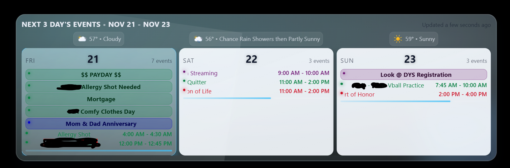

# MMM-GlassDailyCalendar

Glass-style horizontal daily calendar strip for MagicMirror `bottom_bar`. Pulls ICS feeds plus optional events from Calendar/MyAgenda and weather from MMM-AmbientWeather + weather.gov to keep a concise, day-by-day view.

## Features
- ICS fetch/parse with RRULE expansion via `node_helper`, plus optional data from MagicMirror Calendar, MMM-MyAgenda, and MMM-AmbientWeather notifications.
- Horizontal day row with configurable `daysToShow` and `startDayOffset`, with busy bar, marquee overflow, and per-day visibility toggles.
- Icon mapping per keyword/calendar using Font Awesome, Boxicons, Iconoir SVGs, or Iconify.
- Themes: light/dark/auto/autoSun (switches by sunrise/sunset hours), with today highlighting and optional past-day dimming.
- Optional per-date or rule-based backgrounds to personalize day chips.
- Weather row: AmbientWeather realtime for today and weather.gov forecast for upcoming days (lat/long).

## Screenshots
Replace these placeholders with your captures (suggested paths in `docs/media/`):



## Prerequisites
- MagicMirror.
- Optional data sources:
  - MagicMirror default Calendar module broadcasting `CALENDAR_EVENTS`.
  - MMM-MyAgenda broadcasting `MYAGENDA_EVENTS`.
  - MMM-AmbientWeather broadcasting `AMBIENT_WEATHER_DATA`.
- Node.js dependencies are installed locally via `npm install`.

## Installation
```bash
cd ~/MagicMirror/modules
git clone https://github.com/hearter20176/MMM-GlassDailyCalendar.git
cd MMM-GlassDailyCalendar
npm install
```

## Configuration
Add to `config/config.js`:
```js
{
  module: "MMM-GlassDailyCalendar",
  position: "bottom_bar",
  config: {
    header: "Today & Next",
    locale: "en",

    // Layout
    daysToShow: 5,
    startDayOffset: 0,
    highlightToday: true,
    dimPastDays: true,
    marqueeEvents: false,      // scroll long titles instead of truncate
    marqueeThreshold: 26,
    maxEventsPerDay: 4,
    showOverflowIndicator: true,
    performanceProfile: "auto", // "auto" | "pi" | "full"
    reduceMotion: false,        // true disables marquee/lottie on Pi or reduced-motion

    // Sources (toggle per module)
    useCalendarModule: false,
    useMyAgenda: true,
    useAmbientWeather: true,
    icalSources: [
      { url: "https://example.com/holidays.ics", name: "Holidays", color: "#38bdf8" }
    ],

    // Weather.gov forecast (future days)
    weatherGov: {
      enabled: true,
      latitude: 40.0,
      longitude: -105.0
    },

    // Visuals
    theme: "autoSun",          // "dark" | "light" | "auto" | "autoSun"
    sunriseHour: 7,
    sunsetHour: 19,
    eventIcons: {
      "birthday": { type: "fa", icon: "fa-solid fa-cake-candles" },
      "flight":   { type: "box", icon: "bx bx-plane-alt" },
      "office":   { type: "iconoir", icon: "briefcase" },
      "run":      { type: "iconify", icon: "mdi:run" }
    },
    calendarVisibility: { "Holidays": true },
    dayBackgrounds: { "2025-12-25": "/modules/MMM-GlassDailyCalendar/img/christmas.jpg" },
    dayBackgroundRules: [
      { calendar: "holiday", keyword: "snow", image: "/modules/MMM-GlassDailyCalendar/img/winter.jpg" }
    ],

    // Intervals
    updateInterval: 10 * 60 * 1000,
    animationSpeed: 400
  }
}
```

### Options quick reference
- **Data**: `useCalendarModule`, `useMyAgenda`, `useAmbientWeather`, `icalSources[]` (url, name, color).
- **Layout**: `daysToShow`, `startDayOffset`, `maxEventsPerDay`, `showOverflowIndicator`, `marqueeEvents`, `marqueeThreshold`.
- **Theme**: `theme`, `sunriseHour`, `sunsetHour`, `highlightToday`, `dimPastDays`.
- **Icons/backgrounds**: `eventIcons` map, `calendarVisibility`, `dayBackgrounds`, `dayBackgroundRules`.
- **Weather**: `weatherGov.enabled`, `latitude`, `longitude` (required for weather.gov forecast when enabled).
- **Performance**: `performanceProfile` (`auto`/`pi`/`full`), `reduceMotion` to force low-motion and skip lottie/marquee on Pi.

### Notifications & integrations
- Listens for `CALENDAR_EVENTS`, `MYAGENDA_EVENTS`, and `AMBIENT_WEATHER_DATA` when the corresponding `use*` flags are `true`. Ensure those modules are configured to broadcast their payloads.
- ICS feeds are pulled server-side via `node_helper` with RRULE expansion; `rangeStart`/`rangeEnd` are derived from `daysToShow` and `startDayOffset`.

### Notes
- Optimized for `bottom_bar` with a single wide glass card and horizontal day chips.
- Busy bar mixes all-day and timed events; overflow indicator shows when `maxEventsPerDay` is exceeded.
- Weather.gov responses require valid US lat/long; AmbientWeather provides the current conditions row.

## License
MIT
