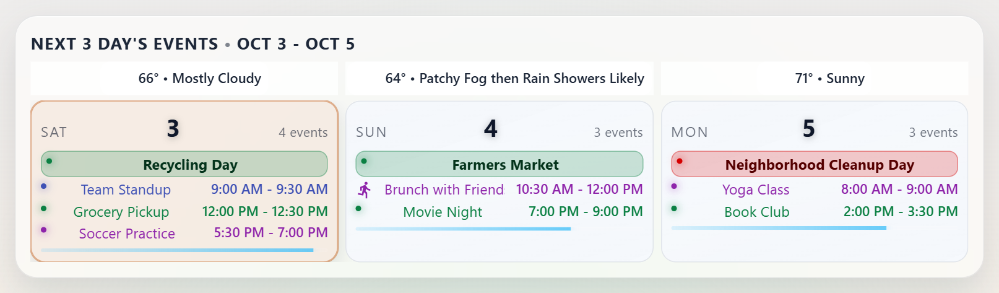

# MMM-GlassDailyCalendar

Glass-style horizontal daily calendar strip for MagicMirror `bottom_bar`. Pulls ICS feeds plus optional events from Calendar/MyAgenda and weather from MMM-AmbientWeather + weather.gov to keep a concise, day-by-day view.

## Features
- ICS fetch/parse with RRULE expansion via `node_helper`, plus optional data from MagicMirror Calendar, MMM-MyAgenda, and MMM-AmbientWeather notifications.
- Horizontal day row with configurable `daysToShow` and `startDayOffset`, with busy bar, marquee overflow, and static per-calendar visibility via `calendarVisibility` (no clickable legend on this module — see MMM-GlassCalendar for that).
- Icon mapping per keyword/calendar using Font Awesome, Boxicons, Iconoir SVGs, or Iconify.
- Themes: light/dark/auto/autoSun. With `autoSun`, the card follows MMM-GlassClock's `<body class="mm-day/mm-night">` page theme (real sunrise/sunset); `sunriseHour`/`sunsetHour` are only a fallback when that isn't available. Today highlighting and optional past-day dimming.
- Optional per-date or rule-based backgrounds to personalize day chips.
- Weather row: AmbientWeather realtime for today and weather.gov forecast for upcoming days (lat/long).

## Screenshot



*Three-day strip in the night theme with sample events: today highlighted, all-day events as pills, timed events with their times, a busy bar per day, and the weather row (AmbientWeather for today, weather.gov for the next days).*

## Prerequisites
- MagicMirror.
- Optional data sources:
  - MagicMirror default Calendar module broadcasting `CALENDAR_EVENTS`.
  - MMM-MyAgenda broadcasting `MYAGENDA_EVENTS`.
  - MMM-AmbientWeather broadcasting `AMBIENT_WEATHER_DATA`. This module also loads its weather Lottie animations directly from `/modules/MMM-AmbientWeather/animations/` (see `resolveLottiePath`), so MMM-AmbientWeather must be installed (even if `useAmbientWeather` is `false`) for those icons to resolve; otherwise only the Font Awesome weather icon is shown.
- Node.js dependencies are installed locally via `npm install`.

## Installation
```bash
cd ~/MagicMirror/modules
git clone https://github.com/hearter20176/MMM-GlassDailyCalendar.git
cd MMM-GlassDailyCalendar
npm install
```

## Update

```bash
cd ~/MagicMirror/modules/MMM-GlassDailyCalendar
git pull
npm install --omit=dev
```

Then restart MagicMirror (for example `pm2 restart MagicMirror`).

## Configuration
Add to `config/config.js`:
```js
{
  module: "MMM-GlassDailyCalendar",
  position: "bottom_bar",
  config: {
    header: "Today & Next",
    locale: "en",

    // Layout
    daysToShow: 5,
    startDayOffset: 0,
    highlightToday: true,
    dimPastDays: true,
    marqueeEvents: false,      // scroll long titles instead of truncate
    marqueeThreshold: 26,
    marqueeSpeed: 20,          // px/s scroll speed once marqueeEvents is on
    maxEventsPerDay: 4,
    showOverflowIndicator: true,
    performanceProfile: "auto", // "auto" | "pi" | "full"
    reduceMotion: false,        // true disables marquee/lottie on Pi or reduced-motion

    // Sources (toggle per module)
    useCalendarModule: false,
    useMyAgenda: true,
    useAmbientWeather: true,
    icalSources: [
      { url: "https://example.com/holidays.ics", name: "Holidays", color: "#38bdf8" }
    ],

    // Weather.gov forecast (future days)
    weatherGov: {
      enabled: true,
      latitude: 40.0,
      longitude: -105.0
    },

    // Visuals
    theme: "autoSun",          // "dark" | "light" | "auto" (OS prefers-color-scheme) | "autoSun" (page sunrise/sunset)
    sunriseHour: 7,
    sunsetHour: 19,
    eventIcons: {
      "birthday": { type: "fa", icon: "fa-solid fa-cake-candles" },
      "flight":   { type: "box", icon: "bx bx-plane-alt" },
      "office":   { type: "iconoir", icon: "briefcase" },
      "run":      { type: "iconify", icon: "mdi:run" }
    },
    calendarVisibility: { "Holidays": true },
    dayBackgrounds: { "2025-12-25": "/modules/MMM-GlassDailyCalendar/img/christmas.jpg" },
    dayBackgroundRules: [
      { calendar: "holiday", keyword: "snow", image: "/modules/MMM-GlassDailyCalendar/img/winter.jpg" }
    ],

    // Intervals
    updateInterval: 10 * 60 * 1000,
    animationSpeed: 400
  }
},
```

### Options

| Option | Type | Default | Description |
| --- | --- | --- | --- |
| `header` | string | `"Daily Calendar"` | Title shown at the top of the card, followed by the date range. |
| `locale` | string | `"en"` (or MagicMirror's `locale`) | Moment.js locale for day names, dates and times. |
| `daysToShow` | number | `5` | Number of day columns. |
| `startDayOffset` | number | `0` | First day shown, in days from today. |
| `highlightToday` | boolean | `true` | Outline today's column. |
| `dimPastDays` | boolean | `true` | Dim columns before today (only visible with a negative `startDayOffset`). |
| `marqueeEvents` | boolean | `false` | Scroll event titles that are too long to fit. |
| `marqueeThreshold` | number | `26` | Minimum title length, in characters, before a title may scroll. `0` lets any overflowing title scroll. |
| `marqueeSpeed` | number | `20` | Scroll speed in px/s. |
| `useCalendarModule` | boolean | `false` | Also take events from MagicMirror's default calendar module (`CALENDAR_EVENTS`). |
| `useMyAgenda` | boolean | `true` | Also take events from MMM-MyAgenda (`MYAGENDA_EVENTS`). |
| `useAmbientWeather` | boolean | `true` | Use MMM-AmbientWeather's `AMBIENT_WEATHER_DATA` for today's weather cell. |
| `showWeatherRow` | boolean | `true` | Show the weather row above the day columns. |
| `weatherGov` | object | `{ enabled: true, latitude: null, longitude: null }` | weather.gov forecast for upcoming days. Needs US `latitude`/`longitude`; with either left `null` no forecast is fetched. |
| `icalSources` | array | `[]` | ICS feeds fetched by the node helper. Each entry: `url` (string, or an array of URLs fetched separately), `name`, `color`, and optionally `timeZone` with `forceTimeZone: true` to pin floating times. |
| `maxEventsPerDay` | number | `4` | Events listed per day (the `pi` profile caps this at 3). |
| `showOverflowIndicator` | boolean | `true` | Show "+N more" for events past `maxEventsPerDay`. |
| `dayBackgrounds` | object | `{}` | Map of `YYYY-MM-DD` to a CSS background (for example `"url('/path/to.jpg')"`). |
| `dayBackgroundRules` | array | `[]` | `{ calendar, keyword, image }` rules: a day with a matching event gets that background. |
| `eventIcons` | object | `{}` | Keyword to icon map, for example `{ birthday: { type: "fa", icon: "fa-solid fa-cake-candles" } }`. Types: `fa`, `box`, `iconoir`, `iconify`. |
| `calendarVisibility` | object | `{}` | Map of calendar name to `true`/`false`; `false` hides that calendar. |
| `theme` | string | `"autoSun"` | `"dark"`, `"light"`, `"auto"` (OS `prefers-color-scheme`) or `"autoSun"` (follows MMM-GlassClock's day/night page theme). |
| `sunriseHour` / `sunsetHour` | number | `7` / `19` | Whole-hour fallback for `autoSun` when no page theme class is present. |
| `performanceProfile` | string | `"auto"` | `"auto"` (detects Pi/ARM), `"pi"` or `"full"`. The `pi` profile uses static weather icons and no marquee. |
| `reduceMotion` | boolean | `false` | Force the low-motion behaviour on any device (also follows `prefers-reduced-motion`). |
| `updateInterval` | number | `600000` | ICS and forecast refresh interval in ms (10 minutes). |
| `animationSpeed` | number | `400` | DOM update fade in ms. |

### Notifications & integrations
- Listens for `CALENDAR_EVENTS`, `MYAGENDA_EVENTS`, and `AMBIENT_WEATHER_DATA` when the corresponding `use*` flags are `true`. Ensure those modules are configured to broadcast their payloads.
- ICS feeds are pulled server-side via `node_helper` with RRULE expansion; `rangeStart`/`rangeEnd` are derived from `daysToShow` and `startDayOffset`.
- `"auto"` follows the OS/browser `prefers-color-scheme` media query, checked once when the card renders (there's no live listener for a mid-session OS theme change); this is distinct from `"autoSun"` below. Electron on Raspberry Pi OS usually reports `light` unless the system is explicitly set to dark mode.
- With `theme: "autoSun"`, the card prefers `<body>`'s `mm-day` / `mm-night` classes (set by MMM-GlassClock from real sunrise/sunset for the current date) over the `sunriseHour`/`sunsetHour` whole-hour fallback, and listens for MMM-GlassClock's `PAGE_THEME_CHANGED` notification to re-render (via `queueDomUpdate`) in sync with the rest of the page. The weather Lottie's own day/night pick (`isDaytimeFromSummary`) follows the same body class first, so it can't disagree with the card around dawn/dusk.
- Each module instance sends its own `identifier` on `GLASSDAILYCALENDAR_FETCH`/`GLASSDAILYCALENDAR_FORECAST`, and the node_helper echoes it back on every response, so running two instances (e.g. one per page in MMM-pages) never cross-delivers events or forecasts between them.

### Fetch errors
- ICS and weather.gov failures are tracked separately (`kind: "ics"` vs `"forecast"` on the error payload) and don't affect each other's UI state.
- **"Calendar unavailable"** appears only while the card has never successfully loaded (`!loaded`, i.e. before its first `GLASSDAILYCALENDAR_EVENTS`) and at least one ICS source has already errored. It's a loading-time state — once the first fetch cycle completes, the header always switches to "Updated ..." or the "N of M" count below, even if every ICS source failed.
- **"N of M calendars failed"** (warning-colored) appears once the card has loaded and any ICS source has errored on this or a later cycle. `M` counts expanded URLs (a single configured source with an array `url: [...]` is fetched once per URL by node_helper, and each can fail independently), not the number of entries in `icalSources`.
- **Forecast failures** show a small "Forecast unavailable" chip in place of a day's weather cell when `weatherGov.enabled` is true, weather.gov has failed, and there's no forecast (or AmbientWeather, for today) data to show instead. This doesn't affect the ICS-only "N of M calendars failed" count.
- The node_helper never sends the raw ICS URL to the front end on error — only the source `name` (or a token-masked URL if no name is set) — since private ICS URLs grant calendar read access.
- weather.gov requests use a 30s timeout, matching the ICS fetch path, so a hung request can't pile up against the next scheduled forecast fetch.

### Animation lifecycle
- Each weather Lottie icon is tracked together with the exact container element `getDom()` created for it; containers are never looked up by id. Players are created only for containers that are attached to the page, at most one per container.
- `getDom()` never destroys live players, because MagicMirror keeps the previous tree on screen during the fade and skips the swap entirely when the markup is unchanged. Players are destroyed once their container is detached, which is checked on MagicMirror's `MODULE_DOM_UPDATED` notification (sent after every `updateDom()` resolves) with a bounded poll as a fallback.
- `suspend()` (module hidden, e.g. by MMM-pages) pauses every player, cancels the poll, and creates nothing while suspended. `resume()` plays every surviving player and binds any containers still waiting. If MagicMirror drops its `resume()` call, a module it reports as visible is treated as resumed on the next render.
- If the `lottie` global is missing, the script is injected once and the current render's containers are bound when it loads. Inline `animationData` objects are tracked the same way as path sources. With `reduceMotion` (or the `pi` profile) no players or timers exist and static Font Awesome icons are shown.

- Title-marquee animations (Web Animations on overflowing event titles) follow the same rule: each is tracked with its element, cancelled once that element is detached (a running animation would otherwise keep the whole old render tree alive), never cancelled in `getDom()`, paused by `suspend()` and played by `resume()`. This applies even when Lottie is disabled.

### Notes
- Optimized for `bottom_bar` with a single wide glass card and horizontal day chips.
- Busy bar mixes all-day and timed events; overflow indicator shows when `maxEventsPerDay` is exceeded.
- Weather.gov responses require valid US lat/long; AmbientWeather provides the current conditions row.

## License
MIT
